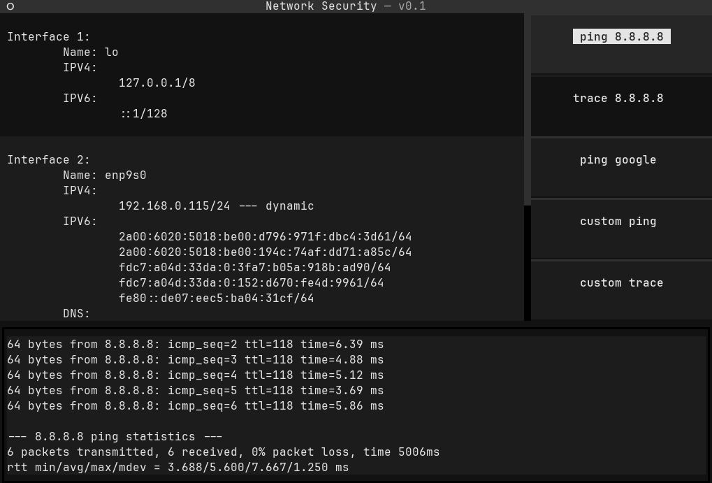
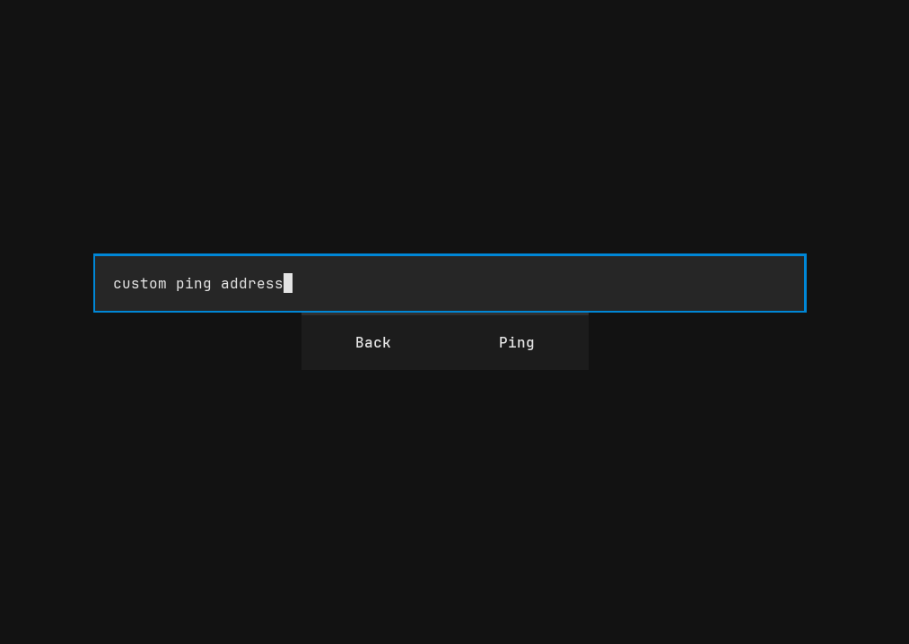

# Security Dashboard (TUI)

A terminal-based network dashboard built with Python and Textual.  
The application displays local network interface information and provides
interactive tools for ping and tracepath directly from a TUI.

This project was built as a learning exercise to explore:
- Python project structure
- Subprocess handling and streaming output
- Textual (TUI framework)
- Basic networking utilities
- Git and GitHub workflow

## Features

- Displays detected network interfaces and IP addresses
- Ping common targets (8.8.8.8, google.com)
- Run tracepath to common targets
- Custom ping and tracepath input via popup screens
- Live streaming command output inside the TUI




## Requirements

- Python 3.10+
- Linux (uses `ping` and `tracepath`)
- Textual

## Installation

Clone the repository:

```bash
git clone https://github.com/hurtfulclub/security_dashboard.git
cd security_dashboard
